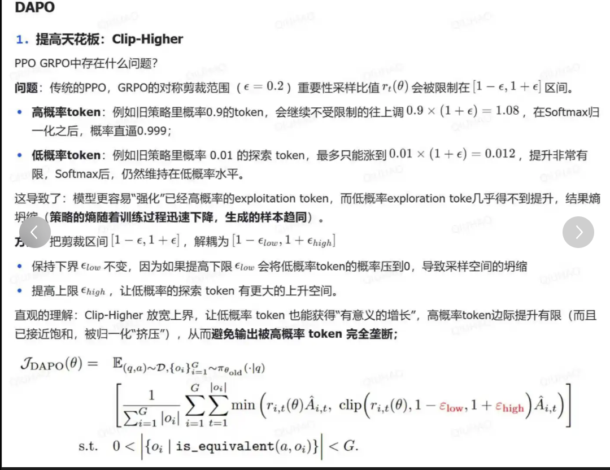
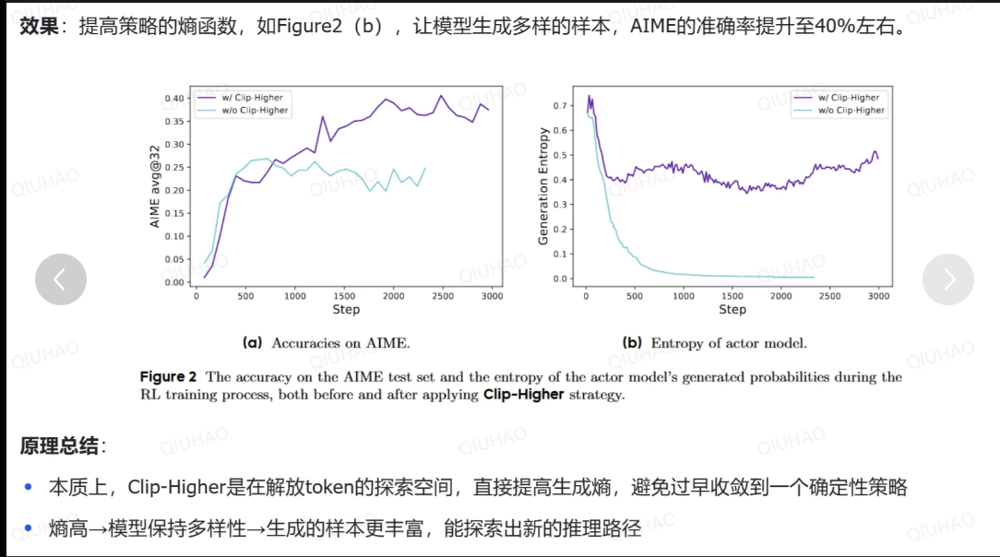

1. 简单介绍一下 RLHF？

2. RLHF 在实践过程中存在哪些不足？

3. 如何解决三个阶段的训练（SFT->RM->PPO）过程较长，更新迭代较慢问题？

4. RM模型训练数据如何构建？PPO的数据格式？

5. DPO vs RLHF？ 介绍一下 DPO的损失函数？

6. dapo 相比 grpo的改进？
- clip-higher：

7. 一文核心对比PPO、GRPO、DAPO、GSPO、DCPO
小红书-灰一会

8. RLHF 为啥不稳定，有啥trick？
- https://mp.weixin.qq.com/s/qSF3IYVTVKCt_XCfR2VeEQ

9. ppo、grpo、dapo、gspo、cispo
- ppo：
    4个模型；policy  value  reference  reward ；
    使用gae来计算优势函数
    actor-critic 架构；原始actor架构 loss = R log(p); 训练不稳定，引入critic 基线 loss = （R -（v_t-v_t+1）） log(p)
    为了提升效率off-policy；引入重要性采样概念 p_new / p_old
    p_new 和 p_old 不能相差太多，所以引入了clip （不要太高；不要太低） 和 KL
    critic信用分配问题：已知答案，但要知道那个部分贡献最大；当前步的奖励大于后面步骤
- grpo
    2个模型； policy 和reference， reward为可验证的函数
    使用 x- mean / std来计算优势值，使用序列的优势值来代替token
- reinforce ++
    batch 内做平均，而不是组内
- dapo 
    grpo优化
    high-clip；length punish；token-level；动态采样
- gspo
    grpo优化
    优势为序列级别；但是重要性采样为token级别
    序列级别的重要性采样
- cispo 
    grpo优化
    旧策略关键token概率很小，导致重要性采样很大，被clip掉，损失为常数，梯度为0
    将clip和取最小值的操作放在重要性采样那里，并且detach梯度
