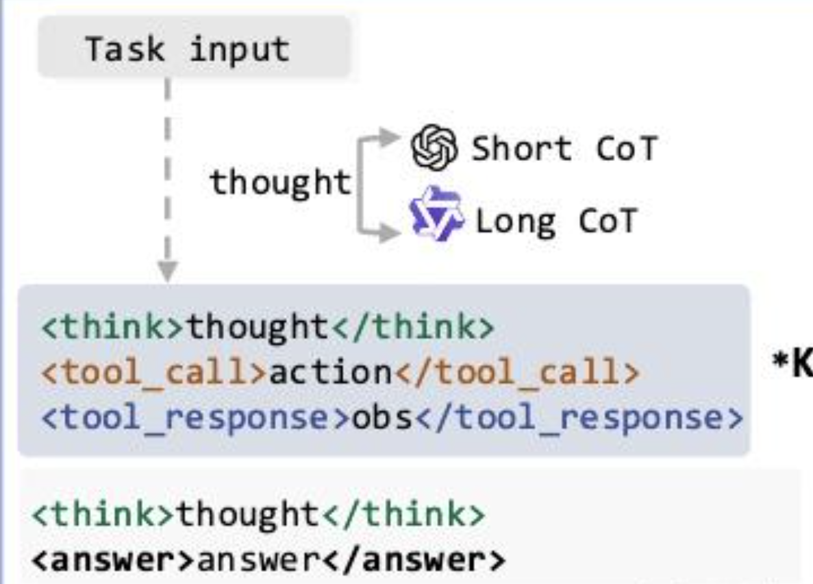

# 数据合成

1. 直接蒸馏：已知问题，使用强model rollout；仅保留true answer
2. CRAWLQA 爬虫法: 针对网站集合 R；获得访问轨迹P；调用大模型得到QA = LLM（content（P））
3. E2HQA 逆向工程法：即针对简单问答对 （Q，A）；提取实体E（Q）；搜索S（E（Q））；用搜索信息替代原始Q； Q_n+1 = replace(Q_n, E(Q), S（E（Q））)

tips：
1. short think 可以通过gpt使用react方式生成，合成在步骤i的short think时保留之前的think； 但对于long think，使用qwq在合成步骤i的long think是要清除之前的think
2. 可以将think 拆分为原子think；形式上，我们在包含了思考内容的<think>块中，增加了<atom-think>子块，即多个原子思维构成了最后的思考

## 数据格式
1. 理解qwen chat-template; 
    - system 和 tools。如果有tools，则先拼接system，再拼接tools；如果没有tools，则直接使用system
    - user。如果是user，直接拼接content。
    - assistent。提取reason_content，直接有该字段，或者从content中分割出。添加<think></think>标签，添加<tool_call></tool_call>标签,可以有多个<tool_call>标签
    - tool。包装为 user 消息，并且添加<tool_response>标签

## 数据集
deepdive
mirothink
dr-tulu
aresearch

# Agentic RL infra
## agent repo
1. MiroThinker : 
2. WebExplorer : 根据搜索实体，然后迭代搜索问句
3. dr-tulu : rubric 打分
4. ArenaRL : 使用pair-wise打分

## agent context
1. resum： 达到context * threshold 就进行压缩；training-free
2. slid-window； 只看指定窗口的message

## agent tools

# RL算法

## reward function
1. 对于开放问题，可以使用rubric 打分的机制
2. 随着rl的训练，不同rollout的输出越来越像；信噪比降低;解决方法，不使用单点打分，使用pair-wise打分
- 循环赛，每条轨迹都22对比；o(N^2)
- 基于锚点排名；o(N)
- 种子单淘汰赛；* o(N)；先基于锚点排序；然后根据种子进行淘汰赛
- 双淘汰赛：包括败者组
- 瑞士制；o(nlogn); 分池子3-0池；2-1池等等
3. self-distillation 自蒸馏

## rl algorithm
1. ppo
2. grpo
3. dapo
4. gspo
5. 

# 教程
1. verl实战 https://zhuanlan.zhihu.com/p/1931076626940139506
2. 理论 https://zhuanlan.zhihu.com/p/1998517345900073326
3. 实践复线 [https://zhuanlan.zhihu.com/p/1987092986388038648](https://zhuanlan.zhihu.com/p/1987092986388038648)
4. rubric https://zhuanlan.zhihu.com/p/2004149762870502827

- 数据[https://huggingface.co/datasets/aidenjhwu/ASearcher_en_no-math_Qwen3-8B-reject-sample](https://huggingface.co/datasets/aidenjhwu/ASearcher_en_no-math_Qwen3-8B-reject-sample)

{
    "agent_name": "my_tool_agent",   
    "data_source":"nq",
    "prompt": [
        {
            "content": "You are a helpful and harmless assistant.",
            "role": "system"
        },
        {
            "content": "Answer the given question. You must conduct reasoning inside <think> and <\/think> first every time you get new information. After reasoning, if you find you lack some knowledge, you can call a search engine by <tool_call> query <\/tool_call> and it will return the top searched results between <tool_response> and <\/tool_response>. You can search as many times as your want. If you find no further external knowledge needed, you can directly provide the answer inside <answer> and <\/answer>, without detailed illustrations. For example, <answer> Beijing <\/answer>. Question: total number of death row inmates in the us?",
            "role": "user"
        }
    ],
    "ability": "fact-reasoning",
    "reward_model": {
        "ground_truth": {
            "target": [
                "2,718"
            ]
        },
        "style": "rule"
    },
    "extra_info": {
        "index": 0,
        "question": "who got the first nobel prize in physics?",
        "split": "train"
    }
}

https://github.com/volcengine/verl/tree/main/verl
verl_project_root/
├── run_train_main.sh                                     # 开发自己的训练总控脚本
├── verl/
│   ├── tools/
│   │   ├── web_search.py                                 # 模拟API搜索工具（替换成自己真实的API）
│   │   ├── my_web_search_tool.py                         # 自定义工具
│   ├── experimental/
│   │   ├── agent_loop/
│   │   │   ├── tool_parser.py                            # 自定义tool parser
│   │   │   ├── my_tool_agent_loop.py                     # 自定义AgentLoop
│   │   ├── reward_loop/ 
│   │   │   ├── reward_manager/
│   │   │   │   ├── my_web_search_reward_manager.py       # 自定义reward manager
│   ├── utils/
│   │   ├── reward_score/
│   │   │   ├── my_reward_function.py                     # 自定义Reward Function
├── examples/
│   ├── sglang_multiturn/
│   │   ├── config/
│   │   │   ├── tool_config/
│   │   │   │   ├── my_web_search_tool_config.yaml        # 自定义工具配置化描述

TOOL_CONFIG = "${ROOT_DIR}/examples/sglang_multiturn/config/tool_config/my_web_search_tool.py"
REWARD_PATH = "${ROOT_DIR}/verl/utils/reward_score/my_reward_function.py"
python3 -m verl.trainer.main_ppo \ 
    ......   
    actor_rollout_ref.rollout.multi_turn.max_assistant_turns=3 \
    actor_rollout_ref.rollout.multi_turn.max_parallel_calls=3 \
    actor_rollout_ref.rollout.multi_turn.tool_config_path=${TOOL_CONFIG} \  # 配置步骤（3）的工具
    actor_rollout_ref.rollout.multi_turn.format=hermes \                    # 配置步骤（4）的ToolParser
    actor_rollout_ref.rollout.name=sglang \
    actor_rollout_ref.rollout.mode=async \
    ......   

    reward_model.reward_manager=my_web_search \              #配置步骤（6）自定义的RewardMeneger
    custom_reward_function.path=${REWARD_PATH} \             #配置步骤（7）自定义的reward fucntion 文件
    custom_reward_function.name=compute_score \              #配置步骤（7）自定义的reward fucntion 函数名
2. mlsys https://github.com/zhaochenyang20/Awesome-ML-SYS-Tutorial/tree/main